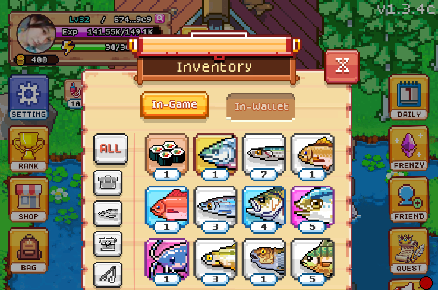
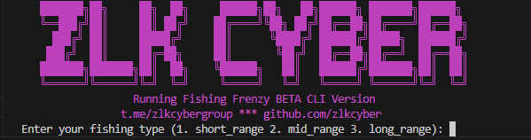

# FISHING FRENZY BOT

Building the onchain economy with @base. Fishing is just the start. 🐟 Developed by @gguncharted

- Twitter [@FishingFrenzyCo](https://x.com/fishingfrenzyco)
- Website [https://fishingfrenzy.co](https://fishingfrenzy.co?code=ZX28FR)



## Features

- **Register Accounts Using New Wallets**
- **Load Existing Tokens**: Load pre-existing tokens if you already have account.
- **Auto Fishing**
- **Auto Daily Checkin**
- **Auto Complete Quest**
- **Auto Buy And Use EXP Scroll**
- **Support Multy Accounts**
- **Support Proxy**

## Requirements

- **Node.js**: Ensure you have Node.js installed.
- **npm**: Ensure you have npm installed.

  

if you already have account you can put `access-token` to `tokens.txt`,

put your proxy in file `proxy.txt` format `http://username:pass@ip:port`

## Setup

1. Clone this repository:
   ```bash
   git clone https://github.com/Zlkcyber/fishfrenzy.git
   cd fishfrenzy
   ```
2. Install dependencies:
   ```bash
   npm install
   ```
3. Setup to create accounts and get Tokens:
   ```bash
   npm run setup
   ```
4. Run The Script:
   ```bash
   npm run start
   ```
5. Additional Feature auto reff
  ```bash
  npm run autoreff
  ```
## 

This project is licensed under the [MIT License](LICENSE).
